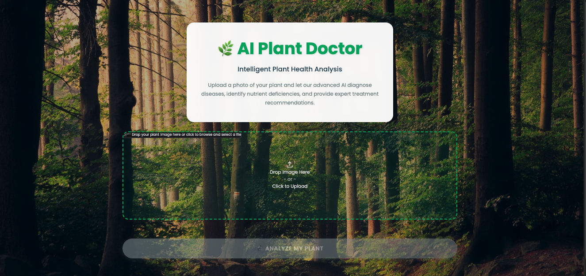
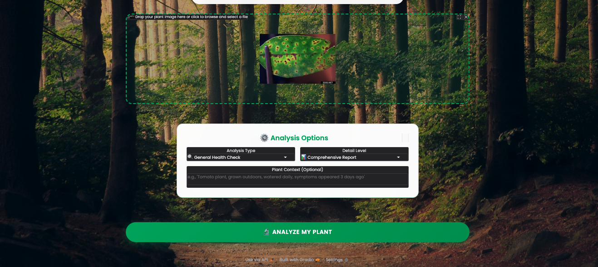
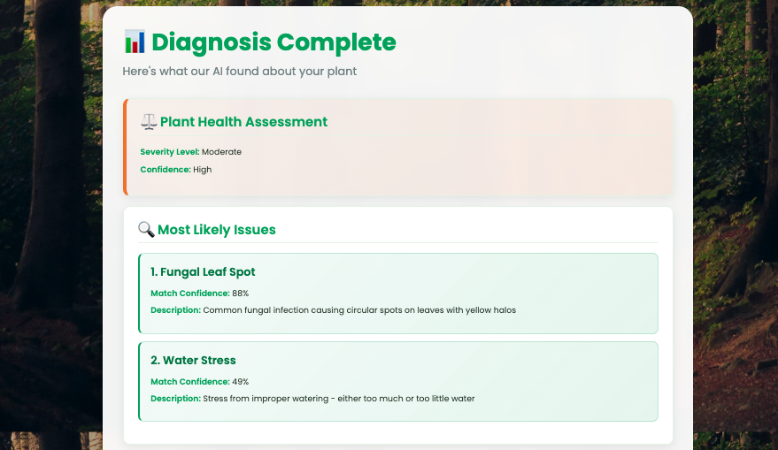
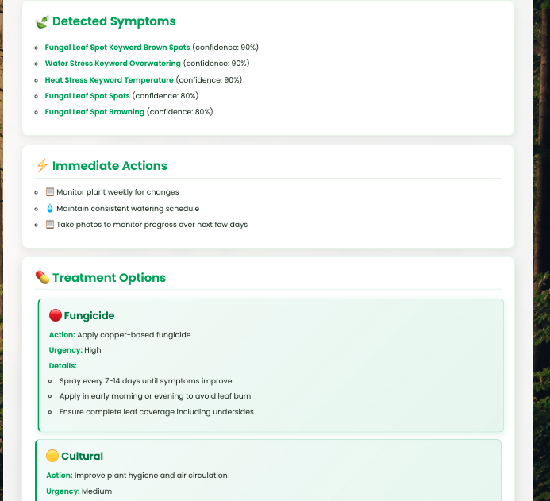
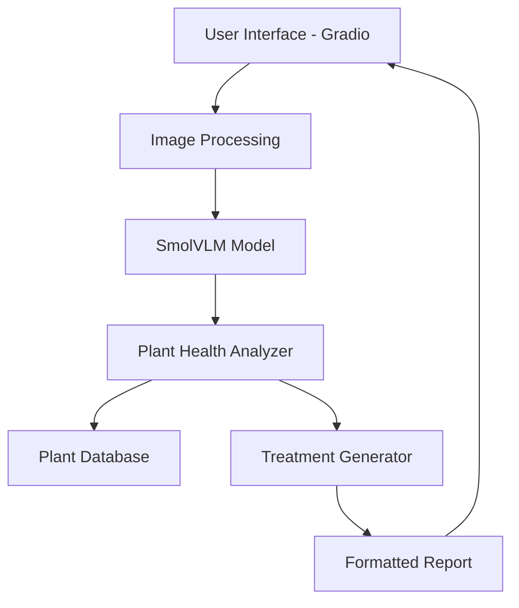

# 🌱 AI Plant Doctor

<div align="center">


[](https://python.org)
[](https://gradio.app)
[](https://huggingface.co/transformers)
[](LICENSE)

**Advanced AI-powered plant health analysis using SmolVLM vision-language model**

[Demo](https://huggingface.co/spaces/your-username/ai-plant-doctor) • [Documentation](#documentation) • [Installation](#installation) • [Usage](#usage)

</div>

---

## 🌟 Features

### 🔍 **Comprehensive Plant Analysis**
- **General Health Assessment** - Overall plant condition evaluation
- **Disease Detection** - Fungal, bacterial, and viral disease identification
- **Nutrient Deficiency Analysis** - NPK and micronutrient deficiency detection
- **Environmental Stress Evaluation** - Water, light, and temperature stress analysis

### 🧠 **AI-Powered Diagnosis**
- **SmolVLM Integration** - State-of-the-art vision-language model
- **Multi-level Analysis** - Basic, comprehensive, and expert diagnostic levels
- **Context-Aware** - Considers plant type, growing conditions, and symptoms
- **Professional Reports** - Detailed diagnostic reports with treatment recommendations

### 💊 **Treatment Recommendations**
- **Immediate Actions** - Urgent care instructions
- **Treatment Plans** - Specific fungicide, bactericide, and cultural treatments
- **Prevention Tips** - Long-term plant health management
- **Recovery Monitoring** - Progress tracking guidelines

### 🎨 **User-Friendly Interface**
- **Beautiful UI** - Modern, responsive design with natural backgrounds
- **Simple Workflow** - Upload → Configure → Analyze → Results
- **Progress Tracking** - Real-time analysis progress with loading animations
- **Detailed Results** - Expandable sections for in-depth analysis

---

## 🖼️ Screenshots

<div align="center">

### Landing Page


### Analysis Configuration


### Results Dashboard



</div>

---

## 🚀 Quick Start

### Prerequisites
- Python 3.8 or higher
- CUDA-compatible GPU (optional, for faster inference)
- 8GB+ RAM recommended

### Installation

1. **Clone the repository**
```bash
git clone https://github.com/your-username/ai-plant-doctor.git
cd ai-plant-doctor
```

2. **Create virtual environment**
```bash
python -m venv venv
source venv/bin/activate  # On Windows: venv\Scripts\activate
```

3. **Install dependencies**
```bash
pip install -r requirements.txt
```

4. **Run the application**
```bash
python gradio_app.py
```

5. **Open your browser**
Navigate to `http://localhost:7860`

---

## 📖 Usage

### Basic Analysis
1. **Upload Image** - Take a clear photo of your plant showing the problem area
2. **Select Analysis Type** - Choose from general health, disease detection, nutrient analysis, or environmental stress
3. **Set Detail Level** - Pick basic, comprehensive, or expert analysis
4. **Add Context** (Optional) - Provide plant type, growing conditions, or symptom timeline
5. **Analyze** - Click "Analyze My Plant" and wait for results

### Photography Tips
- 📸 **Good Lighting** - Use natural daylight for best results
- 🎯 **Focus on Problems** - Ensure affected areas are clearly visible
- 📏 **Proper Distance** - Close enough to see details, far enough for context
- 🔄 **Multiple Angles** - Take several photos if symptoms vary

### Analysis Types

| Type | Best For | Focus Areas |
|------|----------|-------------|
| 🔍 **General Health** | Overall assessment | Complete plant evaluation |
| 🦠 **Disease Detection** | Visible symptoms | Fungal, bacterial, viral diseases |
| 🌱 **Nutrient Analysis** | Deficiency symptoms | NPK and micronutrient status |
| 🌡️ **Environmental Stress** | Growing condition issues | Water, light, temperature stress |

---

## 🏗️ Architecture

### System Components



### Core Modules

- **`gradio_app.py`** - Main application interface and user interaction
- **`model_handler.py`** - SmolVLM model loading, inference, and text processing
- **`plant_health_analyzer.py`** - Symptom extraction, condition matching, and severity assessment
- **`plant_database.py`** - Disease database, treatment protocols, and prevention strategies
- **`utils.py`** - Helper functions for formatting, validation, and reporting

---

## 🔧 Configuration

### Model Settings
```python
# model_handler.py
MODEL_NAME = "HuggingFaceTB/SmolVLM-Instruct"
MAX_TOKENS = 300
TEMPERATURE = 0.3
IMAGE_SIZE = 512  # pixels
```

### Analysis Parameters
```python
# plant_health_analyzer.py
CONFIDENCE_THRESHOLD = 0.6
SEVERITY_LEVELS = ["none", "mild", "moderate", "high", "critical"]
SYMPTOM_PATTERNS = {...}  # Regex patterns for symptom detection
```

---

## 🧪 Development

### Project Structure
```
ai-plant-doctor/
├── 📁 src/
│   ├── 🐍 gradio_app.py           # Main application
│   ├── 🐍 model_handler.py        # AI model integration
│   ├── 🐍 plant_health_analyzer.py # Analysis engine
│   ├── 🐍 plant_database.py       # Knowledge base
│   └── 🐍 utils.py                # Helper functions
├── 📁 docs/                       # Documentation
├── 📁 tests/                      # Unit tests
├── 📁 examples/                   # Example images
├── 📄 requirements.txt            # Dependencies
├── 📄 README.md                   # This file
└── 📄 LICENSE                     # MIT License
```

### Running Tests
```bash
python -m pytest tests/
```

### Code Quality
```bash
# Format code
black src/

# Lint code
flake8 src/

# Type checking
mypy src/
```

---

## 🤝 Contributing

We welcome contributions! Please see our [Contributing Guidelines](CONTRIBUTING.md) for details.

### Development Setup
1. Fork the repository
2. Create a feature branch (`git checkout -b feature/amazing-feature`)
3. Make your changes
4. Add tests for new functionality
5. Ensure all tests pass
6. Commit your changes (`git commit -m 'Add amazing feature'`)
7. Push to the branch (`git push origin feature/amazing-feature`)
8. Open a Pull Request

### Areas for Contribution
- 🌱 **Plant Database** - Add more diseases, treatments, and plant types
- 🧠 **AI Models** - Integrate additional vision models or improve prompts
- 🎨 **UI/UX** - Enhance user interface and experience
- 🧪 **Testing** - Add unit tests and integration tests
- 📚 **Documentation** - Improve docs and add tutorials

---

## 📊 Performance

### Benchmark Results
| Hardware | Analysis Time | Memory Usage |
|----------|---------------|--------------|
| CPU (Intel i7) | ~4-5 minutes | ~4GB RAM |
| GPU (RTX 3080) | ~30-60 seconds | ~6GB VRAM |
| GPU (RTX 4090) | ~15-30 seconds | ~8GB VRAM |

### Optimization Tips
- Use GPU for faster inference
- Resize images to 512px for optimal speed/quality balance
- Enable model caching for repeated analyses
- Use quantized models for memory-constrained environments

---

## 🔬 Technology Stack

### Core Technologies
- **[Python 3.8+](https://python.org)** - Programming language
- **[PyTorch](https://pytorch.org)** - Deep learning framework
- **[Transformers](https://huggingface.co/transformers)** - Model library
- **[Gradio](https://gradio.app)** - Web interface framework
- **[Pillow](https://pillow.readthedocs.io)** - Image processing

### AI Models
- **[SmolVLM-Instruct](https://huggingface.co/HuggingFaceTB/SmolVLM-Instruct)** - Vision-language model for image analysis
- Custom plant health analysis pipeline
- Symptom pattern recognition system

---

## 📋 Roadmap

### Version 2.0 (Coming Soon)
- [ ] 🌍 **Multi-language Support** - Interface in multiple languages
- [ ] 📱 **Mobile App** - Native iOS and Android applications
- [ ] 🔄 **Batch Processing** - Analyze multiple images at once
- [ ] 📈 **Progress Tracking** - Monitor plant health over time
- [ ] 🤖 **API Endpoints** - RESTful API for integration

### Version 2.1
- [ ] 🧠 **Advanced Models** - Integration with larger vision models
- [ ] 🌿 **Plant Identification** - Automatic plant species recognition
- [ ] 📊 **Analytics Dashboard** - Usage statistics and insights
- [ ] 💬 **Community Features** - User forums and expert consultations

---

## ⚠️ Disclaimer

**Important Notice:** This AI tool provides guidance only and is not a substitute for professional agricultural or veterinary advice. 

- 🔬 **For Research Purposes** - Results should be verified by plant pathologists
- 🏥 **Commercial Use** - Consult agricultural experts for commercial crops
- 🧪 **Treatment Testing** - Always test treatments on small areas first
- 📞 **Professional Help** - Seek expert advice for severe or persistent problems

---

## 📄 License

This project is licensed under the MIT License - see the [LICENSE](LICENSE) file for details.

```
MIT License

Copyright (c) 2024 AI Plant Doctor Contributors

Permission is hereby granted, free of charge, to any person obtaining a copy
of this software and associated documentation files (the "Software"), to deal
in the Software without restriction, including without limitation the rights
to use, copy, modify, merge, publish, distribute, sublicense, and/or sell
copies of the Software, and to permit persons to whom the Software is
furnished to do so, subject to the following conditions:

The above copyright notice and this permission notice shall be included in all
copies or substantial portions of the Software.

THE SOFTWARE IS PROVIDED "AS IS", WITHOUT WARRANTY OF ANY KIND, EXPRESS OR
IMPLIED, INCLUDING BUT NOT LIMITED TO THE WARRANTIES OF MERCHANTABILITY,
FITNESS FOR A PARTICULAR PURPOSE AND NONINFRINGEMENT. IN NO EVENT SHALL THE
AUTHORS OR COPYRIGHT HOLDERS BE LIABLE FOR ANY CLAIM, DAMAGES OR OTHER
LIABILITY, WHETHER IN AN ACTION OF CONTRACT, TORT OR OTHERWISE, ARISING FROM,
OUT OF OR IN CONNECTION WITH THE SOFTWARE OR THE USE OR OTHER DEALINGS IN THE
SOFTWARE.
```

---

## 🙏 Acknowledgments

- **[Hugging Face](https://huggingface.co)** - For the SmolVLM model and Transformers library
- **[Gradio Team](https://gradio.app)** - For the amazing web interface framework
- **Plant Pathology Community** - For domain expertise and validation
- **Contributors** - For their valuable contributions and feedback

---

## 📞 Support

### Getting Help
- 📚 **Documentation** - Check our [Wiki](https://github.com/your-username/ai-plant-doctor/wiki)
- 🐛 **Bug Reports** - Open an [Issue](https://github.com/your-username/ai-plant-doctor/issues)
- 💬 **Discussions** - Join our [Discussions](https://github.com/your-username/ai-plant-doctor/discussions)
- 📧 **Email** - Contact us at support@aiplantdoctor.com

### Community
- 🌐 **Website** - [aiplantdoctor.com](https://aiplantdoctor.com)
- 🐦 **Twitter** - [@AIPlantDoctor](https://twitter.com/AIPlantDoctor)
- 💼 **LinkedIn** - [AI Plant Doctor](https://linkedin.com/company/ai-plant-doctor)

---

<div align="center">

**Made with ❤️ for farmers, gardeners, and plant enthusiasts worldwide**

⭐ **Star this repository if you found it helpful!** ⭐

</div>
